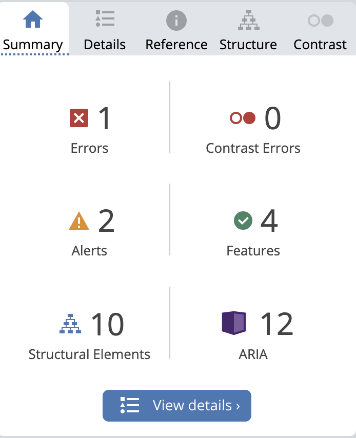
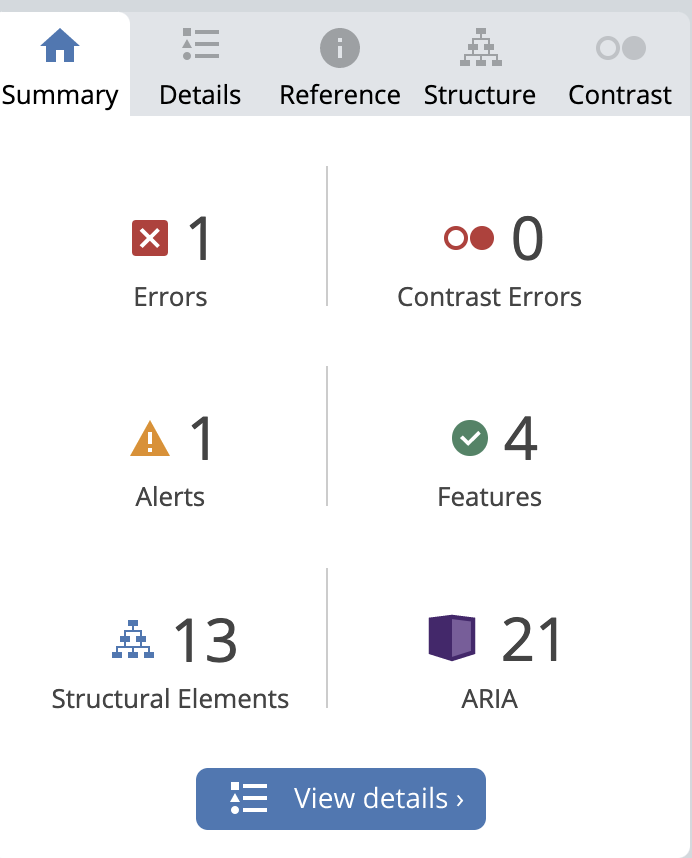
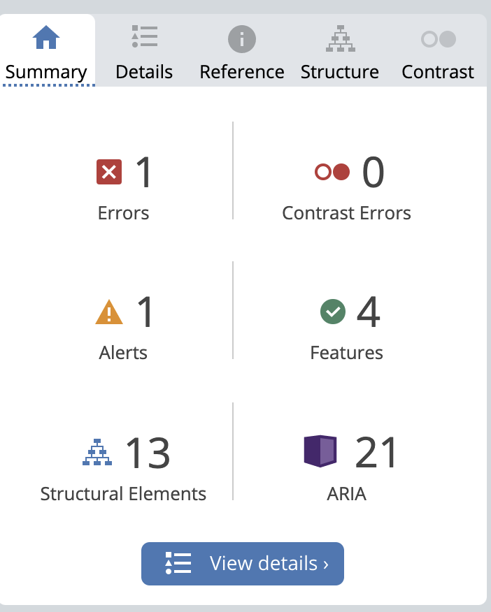
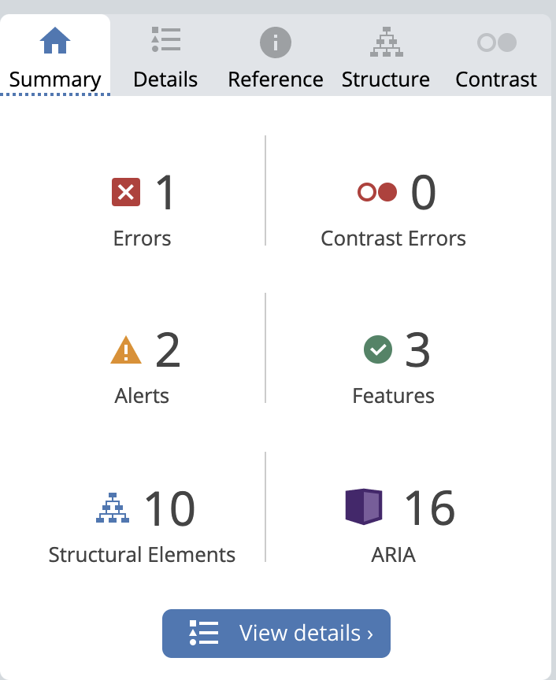
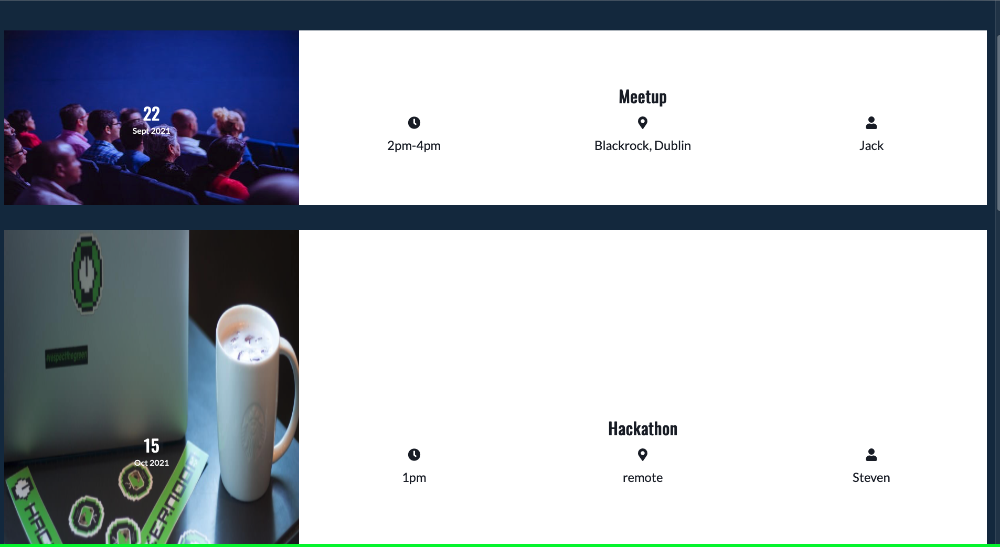
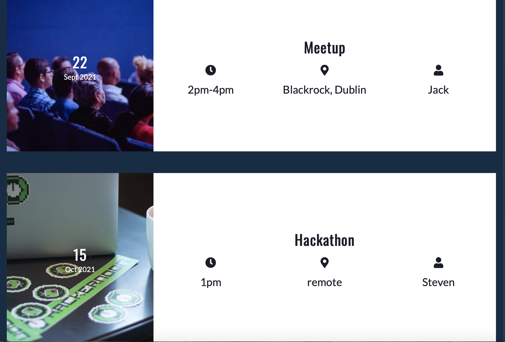

## Contents
* [Introduction](#Code-Nect)
* [UX](#UX)
    * [User Stories](#User-Stories)
        * [User Goals](#User-Goals)
        * [Site Owner Goals](#Site-Owner-Goals)
* [Wireframes](#Wireframes)
* [Design](#Design)
* [Features](#Features)
    * [Navbar](#Navbar)
    * [Hero](#Hero)
    * [Services](#Services)
    * [Footer](#Footer)
    * [About](#About)
    * [Events](#Events)
    * [Contact](#Contact)
* [Technologies Used](#Technologies-Used)
    * [Languages Used](#Languages-Used)
* [Deployment](#Deployment)
    * [Github Pages](#Github-Pages)
* [Testing](#Testing)
* [Bugs](#Bugs)
* [Media](#Media)
* [Credits](#Credits)
---

# Code-Nect
Code-Nect is a website created for developers located in Ireland that are looking to interact with others who are interested in the world of software development. Code-Nect are looking to connect developers of all skills levels to grow a large community of Irish developers.

Code-Nect host meetups and hackathons that allow developers to not only socialise, but to also work together in teams to create fun and interesting projects.

Users of the website will be able to find all the information about Code-Nect by visiting the About, Events, and Sign up pages provided on the site.

View the live project [here](https://jack112-create.github.io/CI-MilestoneProject-1/)

---

## User Experience (UX)

---

## User Stories

 ### User Goals

  - As a user, I want a clear understanding of the sites main purpose.

  - As a user, I want to be able to navigate to other sections and pages of the site to find more information about the organization.

  - As a user, I want to be able to contact Code-Nect directly by finding their social media links or by sign-up form.

  - As a user, I want to know if the organization host any in person events.

 ### Site Owner Goals

  - As a site owner I want users to understand what we do and why we do it.

  - As a site owner I want users to explore and join the Code-Nect community.

  - As a site owner I want users be excited with what they see on the site and how it benefits them.

## Wireframes
  - [Wireframes](readme-files/code-nect-wireframes.pdf)

## Design

  - Colours

  ---

  - My choice of colours for the page originated from wanting to create a site with a tech feel to it. Each colour gives the page a unqiue blend of vibrant and dark colours in order to achieve that tech theme.

  - 

  - Typography

  ---

  - The Oswald font is the main font used throughout the site with Sans Serif as a fallback font. Oswald gives the site a professional feel to it and complements the Lato font used on selected pages.

## Features

---

 ### Navigation Bar

 - Navigation is featured on all 4 pages of the Code-Nect site. The navbar is built mobile first making it fully responsive by displaying a hamburger icon on small screen sizes and full navigation links on desktop.

 - The Code-Nect logo is displayed to the left, inside of the navigation bar while links to other pages such as Home, About, Events and Sign Up which are displayed to the right.

 - The navigation feature makes it easier for users to find different sections of the website, while also providing an idea of the sites content.

 

 ### Hero 

  - The hero displays a welcome message for new users visiting the site. The header continues using the same font color that is used within the navbar above.

  - The hero uses a background image with a black transparent layer on top in order for the white text to be displayed without any contrast issues.

  - The hero also provides a small paragrapgh that gives the user insight into what the site is about.

  

 ### Services 

 - The services section displays what users can expect if they decide that they want to be involved with Cod-Nect.

  - Collaborate: By getting involved with Code-Nect, it allows for developers to collaborate with one another to share ideas and build projects.

  - Portfolio Review: Code-Nect offers developers a chance to receive feedback on their portfolio site and personal projects, this allows developers to grow and learn with the feedback that they receive.

  - Socialize: Code-Nect host hackathons and meetups to give developers around Ireland an opportunity to socialize and get to know everyone personally.

  - Illustrations are used to represent each service, the bright green colour gives the site a tech design.

  

 ### Footer

 - The footer provides the user with links to Facebook, Github and Instagram.

 - The footer has a green border with a grey background to add to the tech theme of the site.

 

 ### About

 - The about page is where users will go if they would like to learn more about Code-Nect.

 

 - Users will find where Code-Nect is based in Ireland and the team behind the organization.

 

 ### Events

 - The events page showcases some upcoming events being hosted by Code-Nect.

 - Each event has an image with a date layered on top, all of the images are used to relate to their respected event. Font awesome icons are used for the time, location, and speaker for each event.

 

 ### Contact

 - The contact page gives the user the choice to provide their details if they wish to get in touch with Code-Nect.

 - The user must fill in all input fields in the contact form or they will be presented with an alert message notifying them to do so.

 - Beside the contact form are contact details for Code-Nect. A location, number and email are all provided as another way to contact Code-Nect directly.

 

 - If the user chooses to fill out the contact form and does so correctly, the will be directed to a new page to thank them for contacting Code-Nect.

 

## Technologies Used

 ### Languages Used:

 - HTML

 - CSS

 ### Frameworks, Libraries & Programs Used:

 1. Google Fonts:
    - Google fonts were used to import both the Oswald and Lato fonts that are used on the site.
    
 2. Git:
    - Git was used for version control to commit and push code to Git and GitHub.

 3. GitHub:
    - GitHub was used to store the project code.

 4. Balsamiq:
    - Balsamiq was used to create the initial designs for the pages on the site.

  5. Font Awesome: 
    - Font Awesome was used to add icons to add to the design and UX of the site.

## Deployment

 ### GitHub Pages:

 1. Log into GitHub.

 2. Select the repository for the Code-Nect project. (https://github.com/Jack112-create/CI-MilestoneProject-1)

 3. Navigate to and click on 'Settings'.

 4. When the page has redirected, navigate to 'GitHub Pages' and proceed to click on the link.

 5. Select branch to 'Main' from sources dropdown.

 6. Click the generated link to the live site.

## Testing

 ### HTML
 - No errors were returned when passing through W3C HTML validator.

 - W3C (https://validator.w3.org/nu/#textarea)

 ### CSS
 - No errors were returned when passing through W3C CSS validator.

- W3C (https://jigsaw.w3.org/css-validator/validator)

 ### Lighthouse
 - Lighthouse was used to test the site performance, accessibility, best practices and SEO. 
 

  ### Wave 
  - The error that reoccurs on all of the pages is due to the empty label used for the navbar checkbox method.
  - The hidden aria labels are due to font awesome icons, to combat this I added aria labels to the anchor tags.
  
  
  
  

## Manual testing

 - The footer would not position itself to the bottom of the screen when the width had reached to a desktop size viewport, this was fixed by adding an "active" class with certain style rules to the body of the pages that had this issue.

 - Manually tested responsiveness by viewing the project on a mobile device such as Iphone SE. Responsiveness was also tested by using [Am I Responsive](http://ami.responsivedesign.is/#).
  
 - Each link was tested on every page to ensure that they work as expected.

 ### Browser testing

 - When testing the site on Safari there was a bug with the events page. The images were not being displayed correctly as each image was a different size. To fix this I removed the img tags in the html file and created divs and set the images as backgrounds. I then added a style rule to set the height of the divs to fix the bug.
 

 - Image below is fixed safari bug.
 

## Known Bugs

- When loading the page for the first time the text flickers before loading the correct fonts that are imported from Google fonts.

## Credit

 ### Media

 - Pexels and Unspalsh is used to get images for the site.

 - Illustrations are generated from (https://undraw.co/illustrations)

 - Am I Responsive is used to check responsiveness on different devices.

 - Favicon.io is used to create my Code-Nect favicon.

 - YouTube video that assisted with the creation of hamburger menu that uses a css checkbox trick. (https://www.youtube.com/watch?v=uugicVDUzMA)

 ### Other
 
 - The slack community provided me with feedback on my project which helped me through the development of the site.

 - I would like to thank my mentor Cans who has provided me with invaluable knowledge of best practices and feedback for this project.